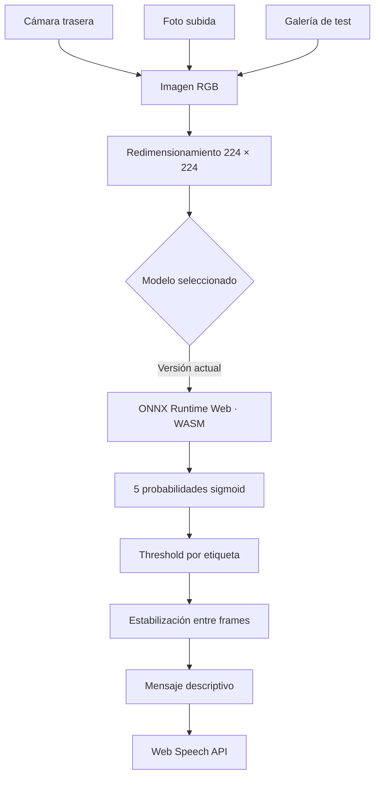

<div align="center">

# Navegación asistida por visión artificial

### Segundo piso del edificio Cornelio Merchán — UPS, sede Cuenca

Aplicación web accesible que identifica elementos de navegación en tiempo real y los
comunica mediante voz para apoyar la orientación de personas con discapacidad visual.

[](https://msreinoso.github.io/PortafolioIA/Proyecto_Navegacion_Multilabel/)


**[Probar la aplicación](https://msreinoso.github.io/PortafolioIA/Proyecto_Navegacion_Multilabel/)** ·
**[Ver el notebook](./training/Proyecto_Navegacion_Multilabel_Optimizado.ipynb)** ·
**[Revisar el código](./app.js)**

</div>

> [!IMPORTANT]
> Este proyecto es una prueba de concepto académica. Describe elementos visibles, pero
> no determina su posición, dirección o distancia. No sustituye el bastón, perro guía,
> señalización, acompañamiento humano ni procedimientos de emergencia.

## Descripción

El sistema puede procesar continuamente la cámara trasera, analizar una foto subida o
probar las 33 imágenes de la partición de test incluida. Realiza clasificación
**multilabel**: una misma imagen puede contener varias etiquetas simultáneamente, como
`puerta` y `pasillo`. La Web Speech API anuncia el resultado en español.

El alcance del dataset está limitado al **segundo piso del edificio Cornelio Merchán**.
Las fotografías de letreros, puertas y pasillos son propias del entorno; las clases
genéricas `escalera` y `obstaculo` incluyen imágenes procedentes de internet.

## Funcionalidades

- Cámara trasera mediante `navigator.mediaDevices.getUserMedia`.
- Carga de fotos JPG, PNG o WebP desde el dispositivo.
- Galería integrada con 33 imágenes de test y sus etiquetas esperadas.
- Comparación visual entre las cinco probabilidades, los thresholds y el resultado esperado.
- Inferencia completamente local en el navegador; los frames y fotos no se envían a un servidor.
- Selector de versiones preparado para incorporar futuros modelos evaluados.
- ONNX Runtime Web como motor de inferencia publicado.
- Cinco salidas sigmoid evaluadas de forma independiente.
- Threshold óptimo específico para cada etiqueta.
- Estabilización temporal para reducir falsos avisos entre frames.
- Síntesis de voz en español mediante `window.speechSynthesis`.
- Prevención de mensajes repetitivos cuando el entorno no cambia.
- Botones grandes, alto contraste, foco visible y regiones `aria-live`.
- Interfaz compatible con teclado, TalkBack y VoiceOver.
- Publicación estática mediante GitHub Pages.

## Demo

Abre la aplicación desde un teléfono con cámara:

### [https://msreinoso.github.io/PortafolioIA/Proyecto_Navegacion_Multilabel/](https://msreinoso.github.io/PortafolioIA/Proyecto_Navegacion_Multilabel/)

1. Selecciona **ONNX — modelo actual**.
2. Pulsa **Iniciar navegación**.
3. Autoriza el uso de la cámara.
4. Apunta la cámara hacia el entorno.
5. Usa **Repetir último aviso** si necesitas escuchar nuevamente el resultado.

También puedes usar **Probar con una imagen** sin conceder permiso de cámara:

1. Sube una foto o elige una de las 33 imágenes del conjunto de test.
2. Pulsa el botón **Analizar** de la opción correspondiente.
3. Revisa las probabilidades, las etiquetas detectadas y, en la galería, las etiquetas
   esperadas del CSV.

## Arquitectura



La normalización de MobileNetV2 está incorporada en ambos modelos mediante
`Rescaling(1/127.5, offset=-1)`. La aplicación entrega píxeles float en el rango
`0–255`; normalizarlos nuevamente produciría entradas incorrectas.

## Etiquetas y thresholds

El orden coincide exactamente con `LABEL_VOCAB` en el notebook de entrenamiento.

| Índice | Etiqueta | Mensaje accesible | Threshold óptimo |
|---:|---|---|---:|
| 0 | `letrero_pared` | Letrero o rótulo en la pared | 0.45 |
| 1 | `puerta` | Puerta | 0.70 |
| 2 | `escalera` | Escalera | 0.35 |
| 3 | `obstaculo` | Posible obstáculo | 0.60 |
| 4 | `pasillo` | Pasillo o corredor | 0.25 |

Si se detecta `obstaculo`, el aviso comienza con **“Atención”**. El sistema no afirma
que el elemento esté a la izquierda, derecha, cerca o lejos porque el modelo es de
clasificación y no de detección/localización de objetos.

## Resultados del modelo

La versión actual de `labels.csv` contiene **219 imágenes válidas** y cinco etiquetas. La
galería publicada reproduce el fallback no estratificado del notebook con
`test_size=0.15` y semilla 42, por lo que contiene **33 imágenes**.

| Métrica | Threshold fijo 0.50 | Thresholds optimizados |
|---|---:|---:|
| F1 macro | 0.8305 | **0.8903** |
| F1 micro | 0.8608 | **0.9000** |
| Hamming Loss | 0.1294 | **0.0941** |
| AUC promedio | 0.93 | 0.93 |

| Etiqueta | F1 con 0.50 | F1 optimizado |
|---|---:|---:|
| `letrero_pared` | 0.98 | **0.98** |
| `puerta` | 0.88 | **0.89** |
| `escalera` | 0.73 | **0.86** |
| `obstaculo` | 0.81 | **0.88** |
| `pasillo` | 0.76 | **0.85** |

> [!NOTE]
> Cambiar solamente el formato del modelo no mejora la precisión. La mejora requiere
> nuevos datos, reentrenamiento, evaluación y actualización de thresholds.

## Modelos disponibles

| Opción | Archivo | Motor | Uso |
|---|---|---|---|
| ONNX — modelo actual | [`modelo_navegacion_multilabel.onnx`](./model/modelo_navegacion_multilabel.onnx) | ONNX Runtime Web 1.26 | Predeterminado |

Los artefactos `model.json` y `.bin` se conservan como referencia de conversión, pero no
se exponen en la interfaz porque el grafo generado desde Keras 3 usa una configuración
que TensorFlow.js Layers 4.22 no puede reconstruir. El modelo ONNX sí fue validado en el
navegador con inferencia real.

El modelo ONNX fue validado con:

- IR version 7 y opset 13.
- Entrada `inputs`: `[batch, 224, 224, 3]`, float32, NHWC.
- Salida `output_0`: `[batch, 5]`, float32.
- 153 nodos y salida sigmoid.

## Tecnologías

| Área | Tecnología |
|---|---|
| Entrenamiento | Python, TensorFlow/Keras, MobileNetV2 |
| Formato principal | ONNX, opset 13 |
| Inferencia web | ONNX Runtime Web, bundle WASM |
| Preprocesamiento de imágenes | TensorFlow.js |
| Cámara | MediaDevices API |
| Voz | Web Speech API |
| Interfaz | HTML5 semántico, CSS, JavaScript |
| Despliegue | GitHub Pages |

## Estructura del proyecto

```text
Proyecto_Navegacion_Multilabel/
├── .nojekyll
├── index.html
├── style.css
├── app.js
├── README.md
├── model/
│   ├── modelo_navegacion_multilabel.onnx
│   ├── model.json
│   ├── group1-shard1of3.bin
│   ├── group1-shard2of3.bin
│   └── group1-shard3of3.bin
├── test-images/
│   ├── manifest.json
│   └── test-*.webp (33 imágenes optimizadas)
└── training/
    ├── Proyecto_Navegacion_Multilabel_Optimizado.ipynb
    └── modelo_navegacion_multilabel.h5
```

## Ejecución local

La cámara requiere un contexto seguro. `localhost` está permitido; abrir `index.html`
directamente con doble clic no es una prueba válida.

```powershell
git clone https://github.com/MSreinoso/PortafolioIA.git
cd PortafolioIA/Proyecto_Navegacion_Multilabel
python -m http.server 8000
```

Abre [http://localhost:8000](http://localhost:8000).

## Conversión de modelos

### Keras H5 → TensorFlow.js

```bash
tensorflowjs_converter \
  --input_format=keras \
  --output_format=tfjs_layers_model \
  modelo_navegacion_multilabel.h5 \
  model
```

### SavedModel → ONNX

```bash
python -m tf2onnx.convert \
  --saved-model modelo_final/saved_model \
  --output modelo_navegacion_multilabel.onnx \
  --opset 13
```

## Publicar una versión mejorada

Los modelos seleccionables están registrados en `MODEL_REGISTRY`, al inicio de
[`app.js`](./app.js). Para incorporar una nueva versión:

1. Entrena y evalúa el modelo con datos adicionales.
2. Conserva el orden de las cinco etiquetas o actualiza `LABELS` explícitamente.
3. Exporta el nuevo `.onnx` o modelo TensorFlow.js dentro de `model/`.
4. Añade una entrada a `MODEL_REGISTRY`:

```js
"onnx-v2": Object.freeze({
  id: "onnx-v2",
  name: "ONNX — modelo mejorado v2",
  runtime: "onnx",
  url: "./model/modelo_navegacion_v2.onnx",
  inputName: "inputs",
  outputName: "output_0",
  layout: "NHWC",
  description: "Nueva versión evaluada con un dataset ampliado.",
}),
```

5. Añade la opción correspondiente en `#model-select` dentro de `index.html`:

```html
<option value="onnx-v2">ONNX — modelo mejorado v2</option>
```

6. Actualiza los thresholds de `LABELS` con los resultados de validación de la nueva
   versión.
7. Comprueba que la entrada sea 224 × 224 × 3 y la salida contenga cinco valores.

La selección queda guardada en `localStorage` y el selector se bloquea durante la
navegación o el análisis de una foto para impedir cambios de motor en medio de una
inferencia. La galería de test permite comparar cada nueva versión con las mismas imágenes.

## Decisiones de accesibilidad

- Acciones principales con áreas táctiles grandes.
- Contraste alto sobre fondo negro.
- Foco visible de seis píxeles.
- HTML semántico y controles nativos.
- Estados comunicados mediante `role="status"`, `role="alert"` y `aria-live`.
- Cámara solicitada únicamente después de una acción del usuario.
- Mensajes de voz breves y descriptivos.
- Tres predicciones positivas consecutivas antes de activar una etiqueta.
- Cuatro predicciones negativas consecutivas antes de retirarla.
- Ocho segundos mínimos entre avisos automáticos.
- Repetición manual disponible sin reiniciar la inferencia.

## Privacidad y seguridad

- El video y las fotos subidas se procesan en memoria dentro del dispositivo.
- La aplicación no transmite ni conserva las fotografías que sube el usuario.
- Las 33 imágenes de test sí forman parte del repositorio como archivos WebP optimizados.
- No utiliza cuentas, cookies analíticas ni un servidor de inferencia.
- Solo se guarda localmente el identificador del modelo seleccionado.

### Limitaciones conocidas

- Dataset reducido y limitado geográficamente al segundo piso.
- `escalera` y `obstaculo` incluyen imágenes externas que pueden diferir del entorno real.
- No estima cajas delimitadoras, dirección ni distancia.
- La iluminación, el movimiento y el ángulo de cámara pueden afectar las predicciones.
- Debe validarse en campo con usuarios y fotografías propias adicionales antes de un uso
  asistencial real.

## Autores

- **Sebastien Reinoso**
- **Doménica Beltrán**

Proyecto desarrollado para la asignatura **Inteligencia Artificial y Aprendizaje
Automático**, Universidad Politécnica Salesiana.

## Referencias

- Sandler, M., Howard, A., Zhu, M., Zhmoginov, A., & Chen, L.-C. (2018).
  *MobileNetV2: Inverted Residuals and Linear Bottlenecks*.
- [TensorFlow.js — conversión de modelos](https://www.tensorflow.org/js/guide/conversion)
- [ONNX Runtime Web](https://onnxruntime.ai/docs/tutorials/web/)
- [MediaDevices: getUserMedia](https://developer.mozilla.org/docs/Web/API/MediaDevices/getUserMedia)
- [Web Speech API](https://developer.mozilla.org/docs/Web/API/Web_Speech_API)

---

<div align="center">

Hecho para explorar cómo la visión artificial puede apoyar experiencias digitales más
accesibles.

</div>
